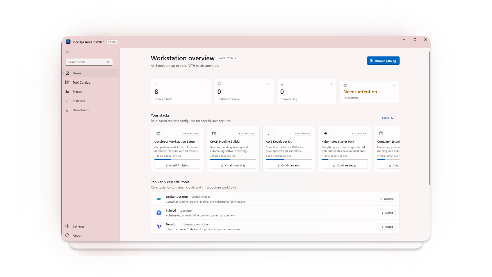

# DevOpsToolsInstaller

<p align="center">
  <em>The native Windows workstation provisioning hub for DevOps and Platform Engineers — 90 official tools, curated stacks, zero silent installs, zero bundled binaries, and zero telemetry.</em>
</p>

<p align="center">
  
  
  
  
  
  
  
</p>

<p align="center">
  
</p>

A high-performance, native Windows 11 desktop application designed to provision cloud, container, Kubernetes, IaC, security, database, and terminal tools on a fresh workstation in minutes.

> [!NOTE]  
> DevOpsToolsInstaller does **not** install anything silently. It downloads official vendor artifacts directly from upstream release endpoints with a real-time progress bar, validates cryptographic Authenticode digital signatures and SHA-256 hashes, and triggers the appropriate context-aware action — launching the vendor's setup wizard, unpacking an archive, or placing a standalone CLI into an isolated user tools folder.

---

## Contents

- [Why](#why)
- [Who This Is For](#who-this-is-for)
- [How It Works](#how-it-works)
- [Application Tour & Navigation](#application-tour--navigation)
- [Tool Categories (90 Tools)](#tool-categories-90-tools)
- [Curated Stacks & Workstation Presets](#curated-stacks--workstation-presets)
- [What Happens After Download](#what-happens-after-download)
- [Installed Tools, Health Checks & Shell Completions](#installed-tools-health-checks--shell-completions)
- [Adding `Tools\bin` to Your PATH](#adding-toolsbin-to-your-path)
- [Security, Integrity & Privacy](#security-integrity--privacy)
- [In-App Auto-Updater](#in-app-auto-updater)
- [Installation & Deployment Options](#installation--deployment-options)
- [Tech Stack](#tech-stack)
- [Catalog Format & Custom Tools](#catalog-format--custom-tools)
- [Troubleshooting](#troubleshooting)
- [FAQ](#faq)
- [Contributing](#contributing)
- [License](#license)

---

## Why

Setting up a new DevOps workstation usually means the same tedious routine: open a dozen browser tabs, chase down vendor download URLs, verify versions, extract archives, configure PATH variables, and run each setup by hand.

**DevOpsToolsInstaller** unifies this workflow into a single, beautifully designed workstation control plane:
- Browse an extensible catalog of **90 official developer and DevOps tools**.
- Choose role-based **Curated Stacks** (Kubernetes Platform Engineer, DevSecOps, Cloud Engineer, IaC Complete, etc.) for rapid 1-click provisioning or catalog filtering.
- Select previous release versions directly from tool cards.
- Verify runtime CLI health checks and generate shell autocompletions.
- Enjoy a translucent **Windows 11 Mica Alt** interface with zero background bloat, zero telemetry, and zero hidden installs.

---

## Who This Is For

- **DevOps, Platform & SRE Engineers** setting up or reprovisioning Windows laptops.
- **Cloud Architects & Developers** working across AWS, Azure, GCP, and Kubernetes ecosystems.
- **IT & Security Teams** who need transparent vendor downloads, Authenticode digital signature auditing, and zero system tampering.

---

## How It Works

```
┌─────────────────────────┐     Direct Vendor Download     ┌────────────────────────┐
│  DevOps Tools Catalog   │  ────────────────────────────► │   Official Artifact    │
│  (90 Tools / 12 Stacks) │                                │  (.msi, .exe, .zip)   │
└─────────────────────────┘                                └───────────┬────────────┘
                                                                       │
                                              Cryptographic Check      ▼
                                       ┌────────────────────────────────────────────┐
                                       │ Authenticode WinVerifyTrust & SHA-256 Hash │
                                       └───────────────────────┬────────────────────┘
                                                               │
                                       ┌───────────────────────┴────────────────────┐
                                       ▼                                            ▼
                           Installer (.msi / .exe)                      Archive / CLI Binary
                           Standard Vendor Wizard                      %LOCALAPPDATA%\...\Tools\bin
                           (User UAC Prompt)                           (1-Click User PATH Setup)
```

1. **Select Tools or Stacks**: Browse individual tools or select a pre-configured stack.
2. **Direct Official Download**: Fetched straight from official vendor repositories (GitHub Releases, AWS, Azure, HashiCorp, CNCF).
3. **Integrity Validation**: Win32 `WinVerifyTrust` checks digital signatures and hashes before execution.
4. **Context-Aware Deployment**: Launch official installers, extract archives, or deploy CLI binaries directly to your workstation.

---

## Application Tour & Navigation

The application uses the Windows 11 **Mica Alt** translucent canvas, native **Segoe Fluent Icons**, and a clean layered layout:

- **🏠 Home (`HomePage`)**: Workstation dashboard displaying catalog metrics (available tools, installed tools, disk consumption), quick-launch action tiles, featured preset stacks, and direct access to security and compliance disclosures.
- **📦 Tool Catalog (`CatalogPage`)**:
  - **90 Cataloged Tools**: Multi-category browsing with 100% official vector SVG logos.
  - **Multi-Version Selector**: Switch between the latest version or specific previous releases with dynamic URL resolution.
  - **Category Filter Chips**: Instant category switching with live tool counts.
  - **Favorites (★)**: Star preferred tools to prioritize them at the top of your catalog.
  - **Profile Import & Export**: Export your tool selections to a `.json` profile file to share across teams or restore setups instantly.
  - **Active Stack Banner**: Interactive banner showing current stack filtering with a single-click "Clear Filter" action.
  - **Adaptive CommandBar**: Dynamically reorganizes controls using a responsive `WrapPanel` across wide monitors, half-screen snapping, and compact windows.
- **🚀 Curated Stacks (`StacksPage`)**: Dedicated full-page view featuring 12 role-based workstation bundles with live tool status checkmarks and dual-action workflows (**Install Stack** or **Select Stack**).
- **📥 Downloads (`DownloadsPage`)**: Concurrent download manager (up to 3 parallel downloads) with transfer speeds, ETA timers, progress bars, and post-download action triggers.
- **🩺 Installed Tools (`InstalledPage`)**:
  - Complete inventory of deployed tools and binaries.
  - **CLI Health Probing**: Executes binaries (`--version` / `-v`) to measure latency (ms) and verify runtime health (Healthy, Degraded, or Missing).
  - **Shell Autocompletion Generator**: Generates autocompletion scripts for PowerShell and Bash with 1-click insertion into `$PROFILE`.
  - **Safe Uninstallation**: Invokes vendor uninstallers via Windows Registry detection or cleanly removes extracted files.
- **⚙️ Settings (`SettingsPage`)**:
  - Theme customization (Light, Dark, or System Default).
  - One-click **"Add to PATH"** with real-time PATH inspection.
  - Disk cache monitor and cleanup.
  - Desktop and Start Menu shortcut creation.
  - Manual **"Check for Updates"** triggering the GitHub update service.
- **ℹ️ About (`AboutPage`)**: Architecture specifications, complete **Security Risks & Precautions**, and legal trademark disclaimers.
- **🔍 Global AutoSuggestBox**: Embedded directly in the left navigation pane for real-time catalog search and direct query forwarding from anywhere in the app.

---

## Tool Categories (90 Tools)

The catalog organizes 90 essential tools across 12 distinct domains:

1. **Cloud Provider CLIs**: AWS CLI, Azure CLI, Google Cloud CLI, OCI CLI, AWS SAM CLI, eksctl, Azure Functions Core Tools.
2. **Containerization & Runtimes**: Docker Desktop, Podman Desktop, Lazydocker, Dive, Kind, Minikube.
3. **Kubernetes Tooling**: kubectl, Helm, k9s, Stern, Kustomize, kubectx, kubens, Helmfile, Cilium CLI, Linkerd, Istioctl, Velero.
4. **Infrastructure as Code (IaC)**: Terraform, OpenTofu, Pulumi, Terragrunt, TFLint, Packer, Ansible, Infracost.
5. **CI/CD & Version Control**: Git, GitHub CLI, GitLab CLI, ArgoCD CLI, Flux CLI, Tekton CLI (`tkn`), Act (local GitHub Actions runner), Dagger, Task.
6. **Security & Secrets Management**: HashiCorp Vault, SOPS, Gitleaks, Snyk CLI, Kyverno CLI.
7. **Policy, Governance & Compliance**: Trivy, Checkov, tfsec, Syft, Grype, Cosign, Open Policy Agent (`opa`).
8. **Networking & Tunneling**: ngrok, Cloudflare Tunnel (`cloudflared`), Tailscale, Wireshark, Nmap, ctop.
9. **Database & Data DevOps**: Flyway CLI, Liquibase, pgcli, mycli, usql, Redis CLI.
10. **Monitoring & Observability**: Prometheus, Grafana, k6 (load testing), Vector, LogCLI.
11. **Developer Editors & Terminals**: Visual Studio Code, Windows Terminal, PyCharm Community, Cursor, Neovim.
12. **Core Utilities & Performance**: jq, yq, Postman, curl, HTTPie, Starship, fzf, ripgrep, bat, fd, eza, zoxide, Delta, PuTTY, WinSCP, 7-Zip.

*(Full specifications live in [`catalog/catalog.json`](catalog/catalog.json).)*

---

## Curated Stacks & Workstation Presets

The **Curated Stacks** section offers 12 opinionated, battle-tested bundles designed to provision a machine for specific engineering disciplines:

| Stack | Description | Core Tools Included |
| :--- | :--- | :--- |
| **Kubernetes Starter Pack** | Core toolset for local and remote cluster management | `kubectl`, `helm`, `k9s`, `minikube`, `stern`, `kustomize`, `kubectx` |
| **Kubernetes Advanced** | Production GitOps, service mesh, and disaster recovery | `kubectl`, `helm`, `argocd`, `flux`, `istioctl`, `cilium-cli`, `velero`, `helmfile`, `k9s` |
| **Cloud Engineer Essentials** | Multi-cloud infrastructure and policy provisioning | `awscli`, `azure-cli`, `gcloud-cli`, `terraform`, `terragrunt`, `tflint`, `infracost`, `vault` |
| **AWS Developer Kit** | Toolkit for AWS cloud, containers, and serverless | `awscli`, `aws-sam-cli`, `eksctl`, `terraform`, `docker-desktop` |
| **DevSecOps Toolkit** | Vulnerability scanning, container signing, and policy auditing | `trivy`, `gitleaks`, `sops`, `cosign`, `syft`, `grype`, `opa`, `kyverno-cli` |
| **CI/CD Pipeline Builder** | Local runner automation and pipeline construction | `git`, `github-cli`, `act`, `dagger`, `task`, `docker-desktop`, `tkn` |
| **IaC Complete** | Comprehensive infrastructure-as-code suite | `terraform`, `opentofu`, `pulumi`, `terragrunt`, `tflint`, `packer`, `vault`, `infracost` |
| **Observability Stack** | Metrics, distributed logging, and performance benchmarking | `prometheus`, `grafana`, `k6`, `vector`, `logcli` |
| **Terminal Power User** | Blazing-fast modern CLI productivity enhancements | `windows-terminal`, `starship`, `fzf`, `ripgrep`, `bat`, `fd`, `eza`, `zoxide`, `delta`, `jq`, `yq` |
| **Container Essentials** | Container build, debug, and vulnerability inspection | `docker-desktop`, `lazydocker`, `dive`, `trivy`, `cosign`, `syft` |
| **Developer Workstation** | Complete one-click bootstrap for a fresh developer machine | `git`, `github-cli`, `vscode`, `docker-desktop`, `kubectl`, `helm`, `terraform`, `jq`, `postman`, `windows-terminal`, `starship` |
| **Networking & Service Mesh** | Secure ingress tunneling and service-to-service networking | `ngrok`, `cloudflared`, `linkerd`, `istioctl`, `cilium-cli` |

### Dual-Action Workflow
- **Install Stack**: Queues and batch-downloads every tool in the stack.
- **Select Stack**: Applies a live filter to the Catalog, enabling you to review, customize, or selectively install tools in the stack.

> [!TIP]
> Use **"Select Stack"** to preview tools in the catalog and customize your installation with selective checkboxes before queueing downloads.

---

## What Happens After Download

Every tool in the catalog is assigned a **kind**, dictating the post-download action:

| Kind | Artifact Formats | Action | Button |
| :--- | :--- | :--- | :--- |
| **Installer** | `.msi`, `.exe` | Launches official vendor setup wizard (surfaces standard Windows UAC prompt) | `Install` |
| **Archive** | `.zip` | Extracts cleanly into per-tool sandbox (`Tools\<tool-id>`) and opens folder | `Extract` |
| **Binary** | `.exe` | Places the standalone binary directly into `Tools\bin` | `Add to Tools` |
| **Script** | `.ps1`, `.sh` | Opens folder for manual inspection — **scripts are never executed automatically** | `Open Folder` |

> [!CAUTION]
> Vendor setup scripts (`.ps1`, `.sh`) are never executed automatically by the app. Always inspect script contents before running them manually in an elevated PowerShell session.

### Where Files Are Stored
- **Downloaded Artifacts**: `%LOCALAPPDATA%\DevOpsToolsInstaller\Downloads`
- **Extracted Archives**: `%LOCALAPPDATA%\DevOpsToolsInstaller\Tools\<tool-id>`
- **Portable CLI Binaries**: `%LOCALAPPDATA%\DevOpsToolsInstaller\Tools\bin`

---

## Installed Tools, Health Checks & Shell Completions

Navigate to the **Installed** tab to manage and verify your local workstation environment:

### 🩺 Real-Time CLI Health Checks
- Directly invokes installed tool binaries using their standard version flags (`--version`, `-v`, or `version`).
- Measures process execution latency in milliseconds.
- Categorizes tools as **Healthy** (working binary), **Degraded** (slow response), or **Missing** (PATH or file failure).
- Click **"Check All CLIs"** to execute batch diagnostics across your entire toolset.

### ⚡ Shell Autocompletion Generator
- Generates native completion scripts for **PowerShell** and **Bash** for tools like `kubectl`, `helm`, `gh`, `docker`, `terraform`, `podman`, and more.
- Provides a one-click **"Add to PowerShell Profile"** button that automatically appends the completion snippet to `$PROFILE` without manual editing.

---

## Adding `Tools\bin` to Your PATH

Standalone CLI binaries (`kubectl`, `kind`, `jq`, `yq`, `helm`, etc.) land in `%LOCALAPPDATA%\DevOpsToolsInstaller\Tools\bin`. 

> [!TIP]
> Open **Settings** in the app and click **"Add to PATH"**. The app immediately registers the folder in your User Environment (`HKCU\Environment\PATH`) with zero administrator elevation required.

Alternatively, to add it via PowerShell:
```powershell
$bin  = "$env:LOCALAPPDATA\DevOpsToolsInstaller\Tools\bin"
$user = [Environment]::GetEnvironmentVariable("PATH", "User")
if ($user -notlike "*$bin*") {
    [Environment]::SetEnvironmentVariable("PATH", "$user;$bin", "User")
    Write-Host "Added $bin to your user PATH. Restart your terminal to apply."
}
```

> [!IMPORTANT]  
> After updating your PATH (either via the in-app Settings button or PowerShell), restart any active terminal instances (PowerShell, CMD, Windows Terminal, or VS Code) so they can detect the newly added CLI binaries.

---

## Security, Integrity & Privacy

DevOpsToolsInstaller was built with an uncompromising security model:

1. **No Silent Installs**: The app never executes third-party installers silently in the background. Installers display their native vendor wizards and standard Windows User Account Control (UAC) prompts.
2. **Win32 Authenticode Verification**: The app leverages the native Windows `WinVerifyTrust` API to inspect cryptographic signatures on downloaded `.exe` and `.msi` installers against trusted Certificate Authorities prior to launching.
3. **SHA-256 Hash Validation**: Catalog entries include cryptographic checksums to guard against payload tampering or incomplete downloads.
4. **Direct Vendor Artifacts**: Downloads point exclusively to official vendor release infrastructure (GitHub Releases, Amazon S3, Azure CDN, HashiCorp Releases). No proxy mirrors, no intermediary repackaging, and no modified binaries.
5. **Isolated User Sandbox**: Portable tools extract strictly into `%LOCALAPPDATA%\DevOpsToolsInstaller\`. System-wide directories (`Program Files`, `Windows\System32`) and Machine PATH (`HKLM`) are never touched without standard vendor installer elevation.
6. **Zero Telemetry**: No analytics, no user tracking, no phone-home pings, and no background daemon services.

---

## In-App Auto-Updater

DevOpsToolsInstaller includes an integrated, zero-friction updater:
- Automatically checks the GitHub Releases API on launch (and on-demand via **Settings → Check for Updates**).
- Displays release notes, version comparisons, and asset sizes in a native Fluent dialog.
- Downloads the new release with real-time progress, verifies checksums, safely stages the update, and restarts smoothly.

---

## Installation & Deployment Options

DevOpsToolsInstaller provides two official distribution formats available from [GitHub Releases](https://github.com/NotHarshhaa/DevOpsToolsInstaller/releases/latest):

### ⚡ Option 1: Windows Package Manager (WinGet)
Install directly from your terminal using native Windows Package Manager:
```powershell
winget install DevOpsToolsInstaller
```
*(or explicitly by package ID: `winget install --id NotHarshhaa.DevOpsToolsInstaller`)*

### 🧙 Option 2: Windows Setup Wizard (Recommended)
Download **`DevOpsToolsInstaller_x64_Setup.exe`**:
- **System or User Installation**: Installs all application binaries, WinUI 3 libraries, vector logos, and catalogs to `C:\Program Files\DevOpsToolsInstaller` (or a custom location on `C:\`).
- **Desktop & Start Menu Shortcuts**: Automatically configures accessible shortcuts.
- **Automatic PATH Configuration**: Registers the application directory in your system or user PATH environment variable.
- **Clean Uninstallation**: Fully integrated with Windows Settings (*Installed apps* / *Programs and Features*).

### 🚀 Option 3: Portable Single-File Executable
Download **`DevOpsToolsInstaller_x64.exe`** (or `_arm64.exe` for ARM64 devices):
- Single self-contained executable with embedded compression.
- Completely portable: drop it onto a USB drive, `Downloads`, or `Desktop` and launch immediately with zero installation.

---

## Tech Stack

- **Framework**: WinUI 3 via Windows App SDK 1.6
- **Runtime**: .NET 8.0 (Self-Contained, Single-File Compressed)
- **Architecture**: MVVM with CommunityToolkit.Mvvm
- **Styling**: Windows 11 Fluent Design with Mica Alt backdrop and Segoe Fluent Icons
- **Security**: Win32 Cryptographic APIs (`WinVerifyTrust`, `Wintrust.dll`)

---

## Catalog Format & Custom Tools

The catalog is stored in plain JSON (`catalog/catalog.json`) and fetched dynamically from GitHub at runtime (with an embedded offline fallback):

```jsonc
{
  "id": "terraform",
  "name": "Terraform",
  "category": "Infrastructure as Code",
  "description": "Infrastructure as Code tool for provisioning cloud resources",
  "iconGlyph": "\uE74C",
  "kind": "archive",
  "version": "1.9.5",
  "homepage": "https://www.terraform.io/",
  "downloadUrl": "https://releases.hashicorp.com/terraform/1.9.5/terraform_1.9.5_windows_amd64.zip",
  "fileName": "terraform_windows_amd64.zip",
  "sha256": "3a92...",
  "previousVersions": [
    {
      "version": "1.8.5",
      "downloadUrl": "https://releases.hashicorp.com/terraform/1.8.5/terraform_1.8.5_windows_amd64.zip",
      "fileName": "terraform_1.8.5_windows_amd64.zip"
    }
  ]
}
```

To contribute a new tool:
1. Add the tool definition to [`catalog/catalog.json`](catalog/catalog.json).
2. Place the official vector SVG logo in [`src/DevOpsToolsInstaller/Assets/logos/<id>.svg`](src/DevOpsToolsInstaller/Assets/logos/).
3. (Optional) Reference the tool ID in relevant stacks within [`catalog/bundles.json`](catalog/bundles.json).

---

## Troubleshooting

> [!WARNING]  
> If Microsoft Defender SmartScreen displays an *"Unrecognized app"* or *"Windows protected your PC"* notification on newly downloaded releases, this is expected behavior for open-source software before broad global reputation accumulates. Click **"More info"** → **"Run anyway"**, or verify the asset's cryptographic SHA-256 hash against `SHA256SUMS.txt`.

- **CLI Tool Not Found in Terminal**: Ensure you have added `Tools\bin` to your PATH (via **Settings → Add to PATH**) and restarted your terminal session.
- **Offline Catalog Loading**: If offline, the application automatically loads the embedded local catalog copy. Reconnect to the internet and restart to pull the newest releases.

---

## FAQ

**Does this utility run installers silently or bypass UAC?**  
No. Vendor setup wizards run interactively and display their own standard elevation prompts. You remain in complete control of what runs on your workstation.

**Can I use this in an enterprise corporate environment?**  
Yes. The tool operates strictly within user space (`%LOCALAPPDATA%`), performs Authenticode signature verification, avoids modified binaries, and collects zero telemetry.

**Where can I request new tools or stacks?**  
Submit an issue or open a pull request following the [Contributing Guidelines](CONTRIBUTING.md).

---

## Contributing

Contributions are warmly welcomed! Feel free to:
- Propose new DevOps, SRE, or cloud tools to [`catalog/catalog.json`](catalog/catalog.json).
- Submit new role-based stacks in [`catalog/bundles.json`](catalog/bundles.json).
- Improve existing download endpoints, versions, or SVG logos.

Please review [CONTRIBUTING.md](CONTRIBUTING.md) before submitting pull requests.

---

## Acknowledgements

- Free code signing provided by the [SignPath Foundation](https://about.signpath.io/open-source/).

---

## License

This project is licensed under the [Apache-2.0 License](LICENSE).  
*All third-party tool trademarks, logos, and binaries belong to their respective copyright holders.*
